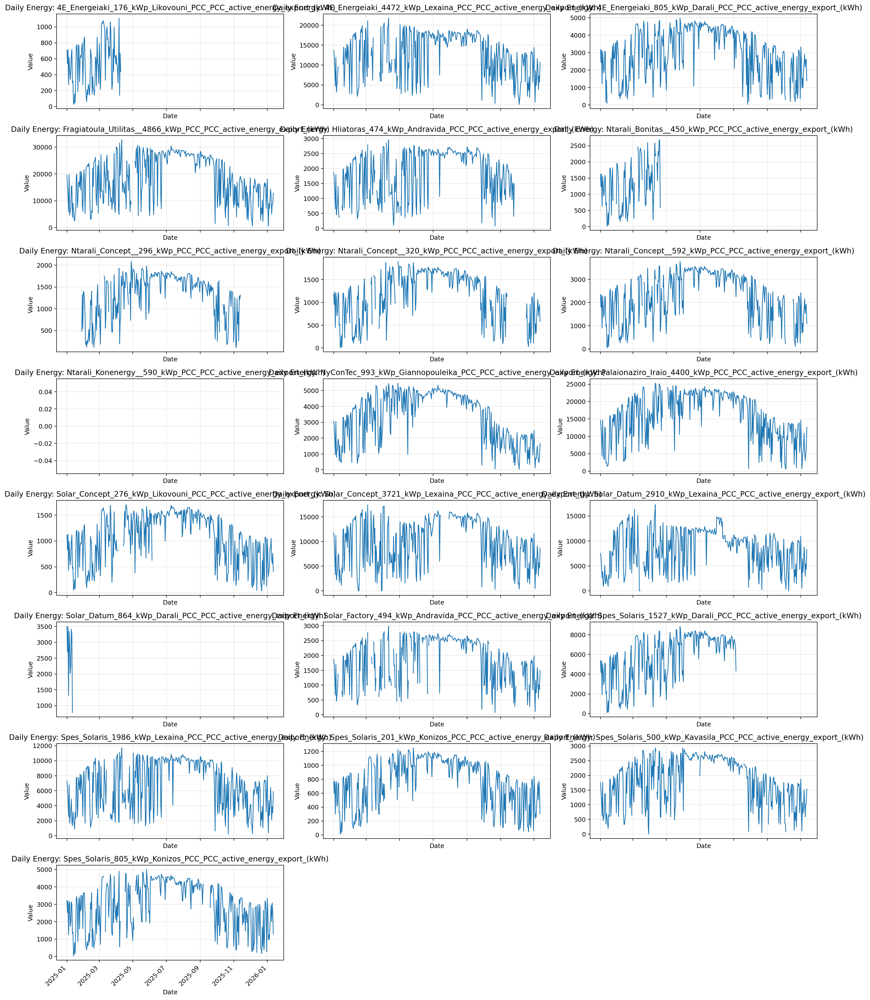
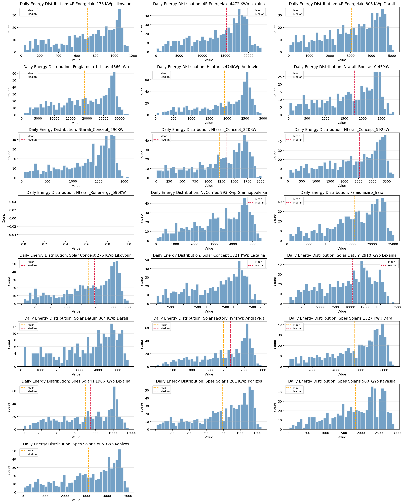
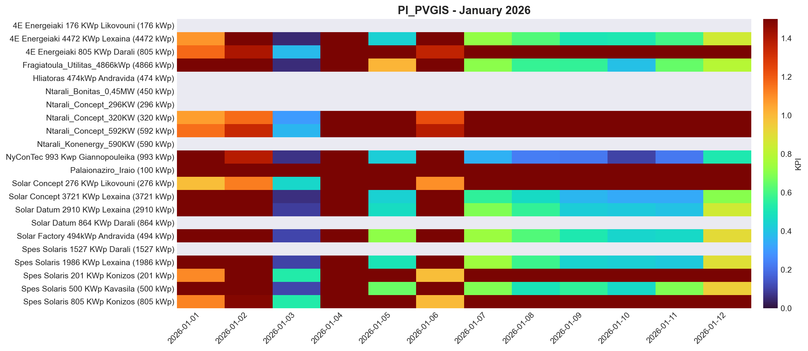
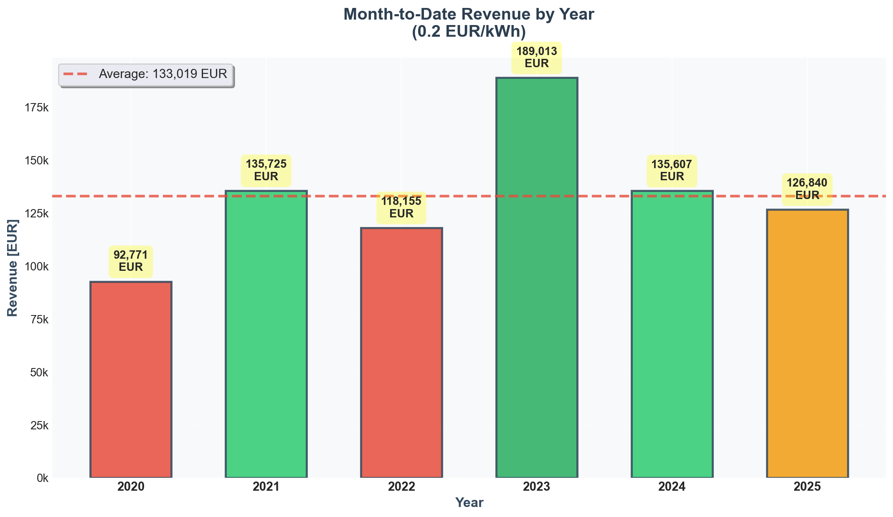

# Weekly PV KPI Analysis Report
**Report Date:** January 16, 2026

---

## Executive Summary

This report presents the weekly analysis of PV park performance using PVGIS-based performance indicators and anomaly detection metrics.

---

## 1. Daily Energy Time Series Analysis

Overview of daily energy production across all PV parks over the analysis period.

**Key Observations:**
- Time series plots show individual park generation patterns
- Seasonal variations and trends are visible across the monitoring period
- Visual inspection helps identify parks with unusual patterns or data gaps

---

## 2. Daily Energy Distribution Analysis

Statistical distribution of daily energy generation for each PV park.

**Key Observations:**
- Histogram distributions show the frequency of different generation levels
- Mean and median values indicate typical performance
- Distribution shapes reveal generation consistency and variability

---

## 3. Performance Index (PI) Heatmap - Full Period

Comparison of measured generation vs. PVGIS expected generation across all parks and dates.

**Key Observations:**
- PI values close to 1.0 indicate performance matching PVGIS expectations
- PI < 0.8 (blue) suggests underperformance requiring investigation
- PI > 1.2 (red) may indicate measurement issues or exceptional conditions
- White/gray areas represent missing data or NaN values

---

## 4. Performance Index (PI) Heatmap - January 2026

Detailed view of recent performance for January 2026.

**Key Observations:**
- Recent performance trends for current month
- Allows identification of recent underperformance events
- Useful for immediate operational decisions and corrective actions

---

## Methodology

### Performance Index (PI) Calculation
- **PI = Measured Generation / PVGIS Expected Generation**
- PVGIS data accounts for:
  - Geographic location (latitude, longitude)
  - System capacity (kWp)
  - System losses (18% assumed)
  - Optimal tilt and azimuth angles
  - Historical solar radiation data (2005-2023)

### Data Quality Notes
- Data gaps appear as white/gray in heatmaps
- Parks with >50% missing data require attention
- Outliers detected using IQR method (multiplier = 1.5)

---

## Recommendations

1. **High Priority:** Investigate parks showing consistent PI < 0.8
2. **Medium Priority:** Review data collection for parks with significant missing data
3. **Monitoring:** Continue tracking recent trends shown in January 2026 analysis
4. **Follow-up:** Schedule detailed analysis for underperforming assets

---

## 5. Month-to-Date Revenue Analysis by Year

Year-over-year revenue comparison for January 1-16 (current month-to-date period).

**Key Observations:**
- 2023 shows the highest month-to-date revenue (€1,890)
- 2021 and 2024 performed consistently above average
- 2020 shows lowest performance (€928) - early year ramp-up period
- Average revenue: €1,330 per month-to-date period
- Overall growth trend: 36.72% from 2020 to 2025 (€927 → €1,268)

**Financial Metrics (at €0.2/kWh):**
- Total Historical Revenue: €7,981.12
- Average Annual Revenue: €45,036.52
- Revenue Volatility (Std Dev): €317.12
- Coefficient of Variation: 23.84% (moderate consistency)

---

## Next Steps

- [ ] Detailed root cause analysis for underperforming parks
- [ ] Validation of data quality issues
- [ ] Update metadata with actual park configurations
- [ ] Implement automated alerting for PI < threshold
- [ ] Continue monitoring revenue trends for seasonal patterns

---

**Report Generated:** January 16, 2026  
**Analysis Period:** Multiple years (see individual plots)  
**Total Parks Analyzed:** 22  
**Tool:** PVGIS PI Heatmap Analysis Notebook
